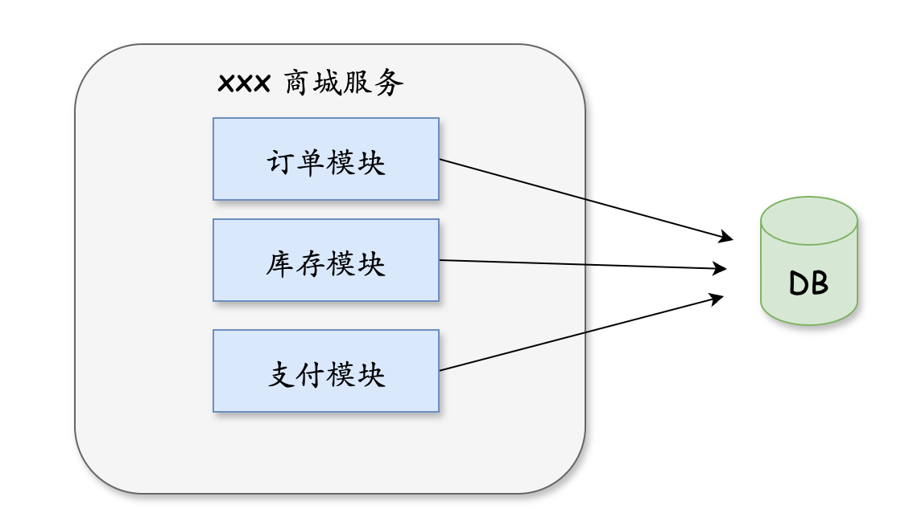

### **分布式事务**

分布式事务是指在多个独立的系统或数据库之间执行的一系列操作，这些操作需要作为一个原子操作来执行，即要么全部成功，要么全部失败。这种机制确保了在分布式环境中数据的一致性。

**为什么会有分布式事务？**

在传统的单体架构下，应用程序的各个模块通常依赖于同一个数据库。这种架构的一个显著优势是，所有操作都在一个数据库中完成，因此可以通过本地事务来保证数据的一致性。事务的ACID（原子性、一致性、隔离性、持久性）特性确保了在一个事务内的所有操作要么全部成功，要么全部回滚，从而保持数据的一致性和完整性。



单体架构模式

但是，随着应用程序规模的扩大和业务需求的增长，单体架构逐渐暴露出一些问题：

1. 数据量激增：单一数据库可能面临着性能瓶颈和存储压力，为了提升性能和扩展性，通常会采取分库/分表, 将数据分散到多个数据库中。
2. 微服务架构： 微服务架构将单体应用拆分为多个独立服务，每个服务负责特定的业务功能。每个微服务通常拥有自己的数据库，保证服务的独立性。这意味着一个业务流程可能需要跨多个服务和数据库进行数据操作。


微服务架构模式

在这些情况下，传统的本地事务已经无法满足需求，因为操作涉及多个数据库或多个服务，这就引出了分布式事务的需求。

**挑战**

在分布式系统中实现事务一致性面临许多挑战，主要包括：

- **网络延迟和不可靠性**：网络通信的不确定性可能导致消息丢失或延迟。
- **节点故障**：参与事务的节点可能会在事务执行过程中发生故障。
- **数据复制**：数据可能分布在多个位置，如何确保数据的一致性是一个难题。

## 常见的实现模式

### **2PC**


二阶段提交协议是最常见的分布式事务实现方式。它分为两个阶段：

1. **准备阶段**：协调者向所有参与者发送准备请求，询问是否可以提交事务。参与者在本地执行事务操作，但不提交，并将结果告知协调者。
2. **提交阶段**：如果所有参与者都同意提交事务，协调者会发送提交请求，要求所有参与者提交事务。如果有任何一个参与者不同意提交，协调者会发送回滚请求，要求所有参与者回滚事务

**优点：**

1. **简单**：2PC的流程相对简单，只有预提交和提交两个阶段。
2. **一致性强**：在理想网络环境下，能够保证强一致性。通常情况下，第一阶段

**缺点：**

1. **阻塞性**：在提交阶段，参与者会一直等待协调者的指令，期间无法处理其他事务，导致资源被长时间锁定。
2. **单点故障**：协调者是单点，如果协调者发生故障，整个事务会陷入不确定状态。
3. **数据不一致**：部分参与者执行了 commit 操作，然后其余的参与者没有收到通知。

### **3PC**

三阶段提交协议是对二阶段提交协议的改进，增加了一个预提交阶段，以减少协调者和参与者之间的等待时间，提高系统的可用性。并且还加入了超时机制，参与者超时会自动提交事务。 三阶段提交协议包括以下三个阶段：

1. **准备阶段（Prepare Phase）**：与 2PC 相同，协调者向所有参与者发送准备请求。
2. **预提交阶段（Pre-Commit Phase）**：如果所有参与者都同意提交，协调者会发送预提交请求，参与者在本地预提交事务。
3. **提交阶段（Commit Phase）**：协调者发送最终的提交请求，要求所有参与者提交事务。、

**优点：**

1. **减少阻塞**：通过增加一个准备阶段，减少了参与者被长时间锁定的概率。
2. **更高的容错性**：相比 2PC，3PC 在协调者故障时，系统更容易恢复。

**缺点：**

1. **复杂性增加**：增加了一个阶段，使得实现和理解变得更加复杂。
2. **性能开销更大**：需要更多的网络通信和持久化操作，性能开销更大。

### **基于消息队列**

每个行为都要保证幂等性。

1. 上游服务投递消息，消息状态为待确认
2. 上游服务开启本地事务，执行本地操作，发送执行完成消息。消费服务更新消息状态为已发送。
3. 下游服务消费消息，开启本地事务，执行本地操作，发送执行完成消息。消息服务更新消息状态为已完成。

eg. RocketMQ （消息表维护在 MQ 中）

### **TCC**

每个行为都要保证幂等性。

```
对每个操作，都会补偿操作。
```

**工作流程**

1. Try（尝试）：
   - 预留资源或锁定资源，进行必要的业务检查，但不提交最终的操作。这一步相当于预检查和资源预留。
2. Confirm（确认）：
   - 如果所有的 Try 操作都成功，系统会进入 Confirm 阶段，真正执行最终的操作并提交事务。在这个阶段，系统会使用预留的资源完成实际的业务操作。
3. Cancel（取消）：
   - 如果任何 Try 操作失败，系统会进入 Cancel 阶段，释放预留的资源并回滚操作，以确保系统恢复到初始状态。

**优点：**

- 有完整的补偿操作，超时会自动补偿
- 功能性较高，Try 请求成功之后，短时间出现网络故障的概率比较低，所以 Confirm 和 Cancel 通常都能够正常执行。
- 并发冲突的概率较低。

**缺点：**

- 趋于最终一致性
- 实现成本较高，需要实现三个组件。(Try、Confirm、Cancel)
- Confirm、Cancel 都一直失败时，需要人为介入

| 模型 | 优点                             | 缺点                             |
| ---- | -------------------------------- | -------------------------------- |
| 2PC  | 简单易理解、一致性强             | 阻塞性、单点故障、性能开销大     |
| 3PC  | 减少阻塞、更高的容错性           | 复杂性增加、性能开销更大         |
| MQ   | 高可用性、松耦合、灵活性高       | 一致性延迟、复杂性高、幂等性要求 |
| TCC  | 业务灵活性强、高性能、最终一致性 | 实现复杂、操作粒度大、补偿开销大 |

分布式事务本身就是一个技术难题，业务中具体使用哪种方案还是需要不同的业务特点自行选择，但是我们也会发现，分布式事务会大大的提高流程的复杂度，会带来很多额外的开销工作。

## 参考

https://cloud.tencent.com/developer/article/1806989

https://juejin.cn/post/6844903647197806605#heading-1
