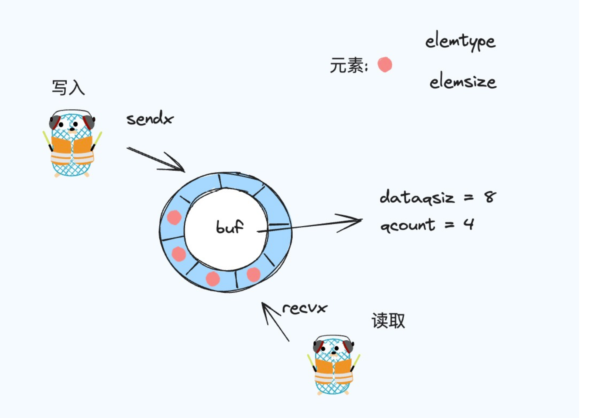

# 理解 Go 语言中的 Channel

Go语言中的 Channel 是一种特殊的类型，它提供了一种在两个或多个协程间传递数据的方式。


## 基础介绍

### 创建

在 Go 语言中，创建一个 channel 非常简单，我们可以使用 make 函数创建一个无缓冲和有缓冲的 channel, 两者的区别在于是否可以存储值。
```go
ch := make(chan int) // 创建一个无缓冲 channel
ch := make(chan int, 10) // 创建一个缓冲区位 10 的 channel
```

### 读写

**阻塞**

```go
ch <- 10  // 写入

val := <-ch // 读取，接受值
<-ch // 读取，不关心值
```

当我们往无缓冲的 channel 中写入值时，需要有另外一个协程在读，不然此时写入的协程就会陷于阻塞状态；
当我们往一个带有缓冲区的的 channel 中写入值时，如果缓冲区没满时，则可以正常写入，当缓冲区满时，则也会陷入阻塞的状态。

**非阻塞**

```go
select {
    case val := <-ch:
            ...
    default:
            ...
}

select {
    case ch <- val:
            ...
    default:
            ...
}
```

尝试从 channel 中读取数据时，使用`select`语句加上`default`分支可实现非阻塞接收。如果 channel 为空，会执行`default`分支的代码。

尝试往 channel 中写入数据时，使用`select`语句加上`default`分支可实现非阻塞写入。如果 channel 已满，会执行`default`分支的代码。


### 关闭

```go
close(ch)
```
当你不需要再向 channel 中写入值时，则可以使用 close 函数关闭 channel。此时，你还是可以从 channel 中读取值。

同时，在从 channel 中读取值时，我们还可以根据 channel 的返回值判断 channel 中是否已经为空, 当接受的第二个值为 false 时，则表示 channel 此时已经为空，val 会返回元素类型的零值。
```go
val, ok := <-ch
```


## 底层实现

### 数据结构

```go
type hchan struct {
	qcount   uint           // total data in the queue
	dataqsiz uint           // size of the circular queue
	buf      unsafe.Pointer // points to an array of dataqsiz elements
	elemsize uint16
	closed   uint32
	elemtype *_type // element type
	sendx    uint   // send index
	recvx    uint   // receive index
	recvq    waitq  // list of recv waiters
	sendq    waitq  // list of send waiters

	// lock protects all fields in hchan, as well as several
	// fields in sudogs blocked on this channel.
	//
	// Do not change another G's status while holding this lock
	// (in particular, do not ready a G), as this can deadlock
	// with stack shrinking.
	lock mutex
}

```



在 channel 中，环形缓冲区是一个核心的组成部分，让我们来看一下每一个字段具体的含义：

1. buf： 它是一个指向环形缓冲区的指针，这里存放的是等待传递的数据。
2. dataqsiz ：环形缓冲区的大小，也就是这个缓冲区可以存放多少数据。
3. qcount：它表示我们缓冲区里现在有多少元素。
4. elemsize：每个数据元素的大小。
5. closed：通道是否已经关闭。
6. elemtype：元素的类型。
7. sendx/recvx: 分别是写和读指针，指向写入和读取的位置。
8. sendq/recvq: 分别是发送写入等待队列和读取等待队列，作用于缓冲区满了或者空了的时候，后面会详细介绍。
9. lock: 这个锁确保同一时间内只有一个协程可以修改 channel 状态。


### 创建

```go
func makechan(t *chantype, size int) *hchan {
	elem := t.Elem

	// compiler checks this but be safe.
	if elem.Size_ >= 1<<16 {
		throw("makechan: invalid channel element type")
	}

	if hchanSize%maxAlign != 0 || elem.Align_ > maxAlign {
		throw("makechan: bad alignment")
	}

	mem, overflow := math.MulUintptr(elem.Size_, uintptr(size))
	if overflow || mem > maxAlloc-hchanSize || size < 0 {
		panic(plainError("makechan: size out of range"))
	}

	// Hchan does not contain pointers interesting for GC when elements stored in buf do not contain pointers.
	// buf points into the same allocation, elemtype is persistent.
	// SudoG's are referenced from their owning thread so they can't be collected.
	// TODO(dvyukov,rlh): Rethink when collector can move allocated objects.
	var c *hchan
	switch {
	case mem == 0:
		// Queue or element size is zero.
		c = (*hchan)(mallocgc(hchanSize, nil, true))
		// Race detector uses this location for synchronization.
		c.buf = c.raceaddr()
	case elem.PtrBytes == 0:
		// Elements do not contain pointers.
		// Allocate hchan and buf in one call.
		c = (*hchan)(mallocgc(hchanSize+mem, nil, true))
		c.buf = add(unsafe.Pointer(c), hchanSize)
	default:
		// Elements contain pointers.
		c = new(hchan)
		c.buf = mallocgc(mem, elem, true)
	}

	c.elemsize = uint16(elem.Size_)
	c.elemtype = elem
	c.dataqsiz = uint(size)
	lockInit(&c.lock, lockRankHchan)

	if debugChan {
		print("makechan: chan=", c, "; elemsize=", elem.Size_, "; dataqsiz=", size, "\n")
	}
	return c
}

```
整个 channel 的构造其实可以分为几步：
1. 安全检查：首先，会检查存储元素的类型是否太大，并且检查是否符合内存对齐的要求(比较抽象,具体可以查看相关资料，简单来说是为了优化存储的性能和满足硬件的使用规定，以此来保证安全高效)

2. 计算总空间: 接着, 会根据元素的大小与存储的个数计算出总空间是会超过系统允许的最大内存。`MulUintptr` 函数里就是做了个乘法,然后检查内存是否溢出。

3. 内存分配： 
    - 如果你创建的是一个无缓冲区的 channel，那么，则不需要给你分配存储数据的空间，只需要为 channel 分配一个空间即可。
    - 如果你创建的是一个有缓冲区的 channe，那么除了 channel 的基本空间，则还需要为了分配存储数据的空间。(当你的类型不是指针，则直接给 buf 分配空间即可, 当是指针时，则需要先给 chan 申请内存空间，再分配 buf 的空间)

4. 设置基本属性: 分配完内存空间之后，则需要为其它的基础属性设置值。

5. 调试信息: 如果开启了Channel的调试模式，makechan 会打印关于创建 Channel 的基本信息。


### 写入
当你尝试往一个 channel 写入数据时，chansend函数被调用。整体的逻辑可以分为以下几种情况: 

**1. 往 nil 的 channel 中写入**

```go
func chansend(c *hchan, ep unsafe.Pointer, block bool, callerpc uintptr) bool {
	if c == nil {
		if !block {
			return false
		}

		gopark(nil, nil, waitReasonChanSendNilChan, traceBlockForever, 2)
		throw("unreachable")
	}
    ...
}
```
当往空的 channel 中写入时，如果是非阻塞(Select)的写入，那么则直接返回 false，写入失败；反正，直接抛出 unreachable 错误。


**2. 往关闭的 Channel 中写入**

```go
func chansend(c *hchan, ep unsafe.Pointer, block bool, callerpc uintptr) bool {
	...
	if !block && c.closed == 0 && full(c) {
		return false
	}

	lock(&c.lock)

	if c.closed != 0 {
		unlock(&c.lock)
		panic(plainError("send on closed channel"))
	}
    ...
}
```

当往一个关闭的 channel 中写入数据时
- 非阻塞写入, 直接返回 false, 写入失败
- 阻塞写入, 直接 panic


**3. 写入时有等待接收的协程**
```go
func chansend(c *hchan, ep unsafe.Pointer, block bool, callerpc uintptr) bool {
	...
	if sg := c.recvq.dequeue(); sg != nil {
		send(c, sg, ep, func() { unlock(&c.lock) }, 3)
		return true
	}
    ...
}
```
当此时等待接受的队列不为空时，则直接将数据发送给等待队列(会唤醒等待队列)。

**4. 当环形缓冲区未满时**
```go
func chansend(c *hchan, ep unsafe.Pointer, block bool, callerpc uintptr) bool {
	...
	if c.qcount < c.dataqsiz {
		qp := chanbuf(c, c.sendx)
		if raceenabled {
			racenotify(c, c.sendx, nil)
		}
		typedmemmove(c.elemtype, qp, ep)
		c.sendx++
		if c.sendx == c.dataqsiz {
			c.sendx = 0
		}
		c.qcount++
		unlock(&c.lock)
		return true
	}
    ...
}
```
当没有等待接收队列时，并且环形缓冲区还有空间，那么则可以直接将数据写入到环形缓冲区，写入后更新 sendx 和 qcount。

**5. 当环形缓冲区已经满时**
```go
func chansend(c *hchan, ep unsafe.Pointer, block bool, callerpc uintptr) bool {
	...
	if !block {
		unlock(&c.lock)
		return false
	}

	gp := getg()
	mysg := acquireSudog()
	...
	c.sendq.enqueue(mysg)
	gp.parkingOnChan.Store(true)
	gopark(chanparkcommit, unsafe.Pointer(&c.lock), waitReasonChanSend, traceBlockChanSend, 2)
    ...
}

```
当缓冲区满时，如果是非阻塞写入，那么则直接返回。
当阻塞式写入时，则将它写入到等待队列中，等待有空间时被唤醒。

**6. 唤醒**
```go
func chansend(c *hchan, ep unsafe.Pointer, block bool, callerpc uintptr) bool {
	...
	KeepAlive(ep)

	// someone woke us up.
	if mysg != gp.waiting {
		throw("G waiting list is corrupted")
	}
	gp.waiting = nil
	gp.activeStackChans = false
	closed := !mysg.success
	gp.param = nil
	if mysg.releasetime > 0 {
		blockevent(mysg.releasetime-t0, 2)
	}
	mysg.c = nil
	releaseSudog(mysg)
	if closed {
		if c.closed == 0 {
			throw("chansend: spurious wakeup")
		}
		panic(plainError("send on closed channel"))
	}
	return true
}

```
此时有另外的协程唤醒该写入协程，那么则会判断 Channel 是否已经关闭，如果已经关闭，那么则会直接 panic；反之，则正常返回，写入成功。

### 读取

当你尝试从一个channel 接收数据时，chanrecv 函数被调用。整体的逻辑也可以分为几个部分:

**1. 读取一个空的 Channel**
```go
func chanrecv(c *hchan, ep unsafe.Pointer, block bool) (selected, received bool) {
	if c == nil {
		if !block {
			return
		}
		gopark(nil, nil, waitReasonChanReceiveNilChan, traceBlockForever, 2)
		throw("unreachable")
	}
    ...
}
```
如果试图从一个 nil 的 channel 接收数据，如果是非阻塞（!block）读取，函数立即返回，表示没有接收到任何数据。如果是阻塞式读取，那么会直接抛出一个 unreachable 错误。

**2. 非阻塞式读取空的 channel**

```go
func chanrecv(c *hchan, ep unsafe.Pointer, block bool) (selected, received bool) {
	...
    if !block && empty(c) {
		if atomic.Load(&c.closed) == 0 {
			return
		}
		if empty(c) {
			// The channel is irreversibly closed and empty.
			if raceenabled {
				raceacquire(c.raceaddr())
			}
			if ep != nil {
				typedmemclr(c.elemtype, ep)
			}
			return true, false
		}
	}
    ...
}
```
非阻塞式读取空的 channel 主要分为几步：
1. 如果 channel 未关闭，那么直接返回。代码使用了原子操作 atomic.Load 来确保读取 closed 状态的安全性。
2. 如果 channel 已经关闭，那么进一步判断 channel 是否为空。这里之所以再判断一次，是怕在首次判断 channel 是否为空和判断 channel 是否关闭之间有新的数据写入，接着如果当接收值的指针 ep 不为空时，则会将 ep 指向的内存区域清零，这里是为了确保当数据接收不成功时，通过 ep 读取的数据是确定的（全部为0）。

**3. channel 已关闭，并且缓冲区已经为空**
```go
func chanrecv(c *hchan, ep unsafe.Pointer, block bool) (selected, received bool) {
	...
    lock(&c.lock)

	if c.closed != 0 {
		if c.qcount == 0 {
			if raceenabled {
				raceacquire(c.raceaddr())
			}
			unlock(&c.lock)
			if ep != nil {
				typedmemclr(c.elemtype, ep)
			}
			return true, false
		}
		// The channel has been closed, but the channel's buffer have data.
	} 
    ...
}
```
当 channel 已经关闭并且缓冲区中已经没有数据，那么直接返回。还有剩余数组时，可以继续正常被接收。

**4. channel 未关闭，并且发送等待队列不为空**
```go
func chanrecv(c *hchan, ep unsafe.Pointer, block bool) (selected, received bool) {
	...
    lock(&c.lock)

	if c.closed != 0 {
		...
	} else {
		// Just found waiting sender with not closed.
		if sg := c.sendq.dequeue(); sg != nil {
			recv(c, sg, ep, func() { unlock(&c.lock) }, 3)
			return true, true
		}
	}
    ...
}

func recv(c *hchan, sg *sudog, ep unsafe.Pointer, unlockf func(), skip int) {
	if c.dataqsiz == 0 {
		if raceenabled {
			racesync(c, sg)
		}
		if ep != nil {
			// copy data from sender
			recvDirect(c.elemtype, sg, ep)
		}
	} else {
		// Queue is full. Take the item at the
		// head of the queue. Make the sender enqueue
		// its item at the tail of the queue. Since the
		// queue is full, those are both the same slot.
		qp := chanbuf(c, c.recvx)
		if raceenabled {
			racenotify(c, c.recvx, nil)
			racenotify(c, c.recvx, sg)
		}
		// copy data from queue to receiver
		if ep != nil {
			typedmemmove(c.elemtype, ep, qp)
		}
		// copy data from sender to queue
		typedmemmove(c.elemtype, qp, sg.elem)
		c.recvx++
		if c.recvx == c.dataqsiz {
			c.recvx = 0
		}
		c.sendx = c.recvx // c.sendx = (c.sendx+1) % c.dataqsiz
	}
	sg.elem = nil
	gp := sg.g
	unlockf()
	gp.param = unsafe.Pointer(sg)
	sg.success = true
	if sg.releasetime != 0 {
		sg.releasetime = cputicks()
	}
	goready(gp, skip+1)
}
```
如果此时发送等待队列不为空时:
- 为无缓冲区 channel 时，则直接从发送等待队列中接收最前面的数据。
- 为有缓冲区 channel 时，则此时直接从环形缓冲区的 recvx 位置读取数据，然后 recvx 需要往后移动(+1), 当 recvx 移动到缓冲区的末尾时，则需要重置为 0 。(环形缓冲区的存储可以理解成为一个数组) 由于缓冲区已满，头部和尾部相当于是同一个位置。

**5. channel 未关闭，并且发送等待队列为空**

```go
func chanrecv(c *hchan, ep unsafe.Pointer, block bool) (selected, received bool) {
	...
    if c.qcount > 0 {
		// Receive directly from queue
		qp := chanbuf(c, c.recvx)
		if raceenabled {
			racenotify(c, c.recvx, nil)
		}
		if ep != nil {
			typedmemmove(c.elemtype, ep, qp)
		}
		typedmemclr(c.elemtype, qp)
		c.recvx++
		if c.recvx == c.dataqsiz {
			c.recvx = 0
		}
		c.qcount--
		unlock(&c.lock)
		return true, true
	}

	if !block {
		unlock(&c.lock)
		return false, false
	}
    ...
}
```
当缓冲区有数据时，直接读取数据，需要更新 recvx、qcount 等属性。

**6. 当 channel 无数据时**
```go
func chanrecv(c *hchan, ep unsafe.Pointer, block bool) (selected, received bool) {
	...
    if !block {
		unlock(&c.lock)
		return false, false
	}

	// no sender available: block on this channel.
	gp := getg()
	mysg := acquireSudog()
	mysg.releasetime = 0
	if t0 != 0 {
		mysg.releasetime = -1
	}
	// No stack splits between assigning elem and enqueuing mysg
	// on gp.waiting where copystack can find it.
	mysg.elem = ep
	mysg.waitlink = nil
	gp.waiting = mysg
	mysg.g = gp
	mysg.isSelect = false
	mysg.c = c
	gp.param = nil
	c.recvq.enqueue(mysg)
	// Signal to anyone trying to shrink our stack that we're about
	// to park on a channel. The window between when this G's status
	// changes and when we set gp.activeStackChans is not safe for
	// stack shrinking.
	gp.parkingOnChan.Store(true)
	gopark(chanparkcommit, unsafe.Pointer(&c.lock), waitReasonChanReceive, traceBlockChanRecv, 2)
    ...
}

```
非阻塞式读取，直接返回。当为阻塞式读取时，则会进去等待接收队列，等待被其它写入协程唤醒。

**6. 成功唤醒**
```go
func chanrecv(c *hchan, ep unsafe.Pointer, block bool) (selected, received bool) {
	...
    // someone woke us up
	if mysg != gp.waiting {
		throw("G waiting list is corrupted")
	}
	gp.waiting = nil
	gp.activeStackChans = false
	if mysg.releasetime > 0 {
		blockevent(mysg.releasetime-t0, 2)
	}
	success := mysg.success
	gp.param = nil
	mysg.c = nil
	releaseSudog(mysg)
	return true, success
}
```
如果处于等待状态，一旦有数据可接收或 channel 关闭，等待状态将被解除，此时将被唤醒以处理接收到的数据或响应 channel 的关闭。

## 常见问题

### 关闭 channel 后的效果

关闭 channel 后，再向该 channel 发送数据会引发 panic，但可以从已关闭的 channel 中继续接收数据，直到channel 中的数据被取完为止。关闭一个已经关闭的 channel 也会引发 panic。


### 如何检测一个 channel 是否已经关闭

通过使用带两个返回值的接收操作可以检测到channel是否关闭。例如：

```go
   v, ok := <-ch
```

如果 `ok` 返回 `false`，则表示没有数据可读，并且 channel 已经关闭了。


### 如何实现非阻塞发送或接收？

使用 `select` 语句和 `default` 分支可以实现非阻塞发送或接收。例如：

```go
select {
     case ch <- val:
         // 成功往 ch 中写入 val
     default:
         // 写入失败
     }
```


### 向已满的 channel 发送数据或从空的 channel 接收数据会发生什么？

如果没有使用`select`语句来实现非阻塞的操作，这种尝试将会阻塞协程，直到 channel 有空间可写以或者有数据可读。


### 怎么正确关闭一个 channel 

一般而言，应该由 channel 的发送方来关闭 channel 以表示数据发送完毕。不要在接收方关闭 channel，因为这会导致发送方在写入时遇到 panic，如果多个协程可能发送数据，需要同步协程避免多次关闭 channel。


### 使用 range 来读取 channel 需要注意什么

`range` 用于 channel 时，会一直从 channel 接收数据，直到 channel 被关闭。如果 channel 永远不关闭，`range` 循环就会无限期地继续。

