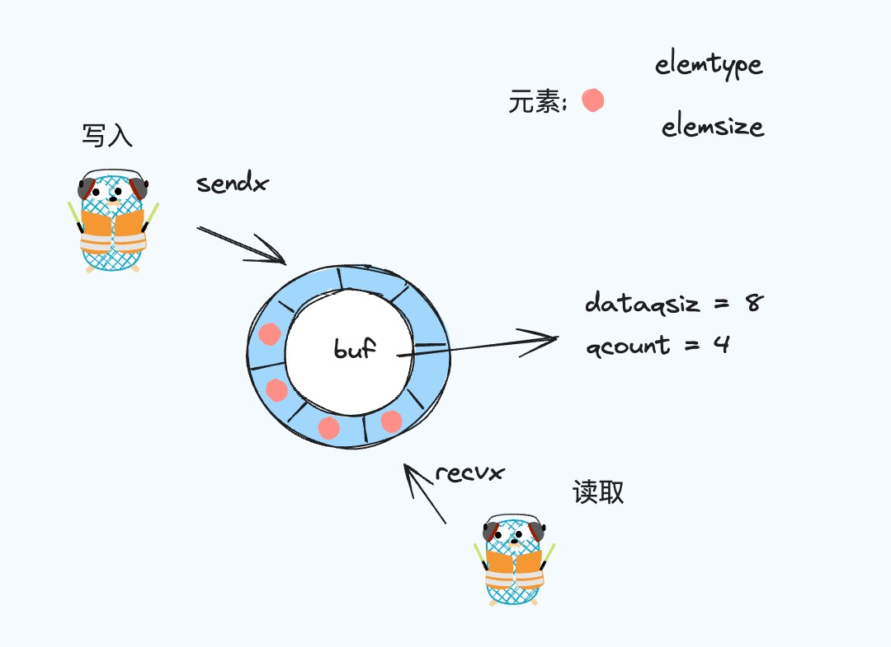

# 理解 Go 语言中的 Channel

Go语言中的 Channel 是一种特殊的类型，它提供了一种在两个或多个协程间传递数据的方式。


## 基础介绍

**创建**

在 Go 语言中，创建一个 channel 非常简单，我们可以使用 make 函数创建一个无缓冲和有缓冲的 channel, 两者的区别在于是否可以存储值。
```go
ch := make(chan int) // 创建一个无缓冲 channel
ch := make(chan int, 10) // 创建一个缓冲区位 10 的 channel
```

**读写**
```go
ch <- 10  // 写入

val := <-ch // 读取，接受值
<-ch // 读取，不关心值
```

当我们往无缓冲的 channel 中写入值时，需要有另外一个协程在读，不然此时写入的协程就会陷于阻塞状态；
当我们往一个带有缓冲区的的 channel 中写入值时，如果缓冲区没满时，则可以正常写入，当缓冲区满时，则也会陷入阻塞的状态。

**关闭**
```go
close(ch)
```
当你不需要再向 channel 中写入值时，则可以使用 close 函数关闭 channel。此时，你还是可以从 channel 中读取值。

同时，在从 channel 中读取值时，我们还可以根据 channel 的返回值判断 channel 中是否已经为空, 当接受的第二个值为 false 时，则表示 channel 此时已经为空，val 会返回元素类型的零值。
```go
val, ok := <-ch
```

## 底层实现

### Channel 底层数据结构

```go
type hchan struct {
	qcount   uint           // total data in the queue
	dataqsiz uint           // size of the circular queue
	buf      unsafe.Pointer // points to an array of dataqsiz elements
	elemsize uint16
	closed   uint32
	elemtype *_type // element type
	sendx    uint   // send index
	recvx    uint   // receive index
	recvq    waitq  // list of recv waiters
	sendq    waitq  // list of send waiters

	// lock protects all fields in hchan, as well as several
	// fields in sudogs blocked on this channel.
	//
	// Do not change another G's status while holding this lock
	// (in particular, do not ready a G), as this can deadlock
	// with stack shrinking.
	lock mutex
}

```



在 Channel 中，环形缓冲区是一个核心的组成部分，让我们来看一下每一个字段具体的含义：

1. buf： 它是一个指向环形缓冲区的指针，这里存放的是等待传递的数据。
2. dataqsiz ：环形缓冲区的大小，也就是这个缓冲区可以存放多少数据。
3. qcount：它表示我们缓冲区里现在有多少元素。
4. elemsize：每个数据元素的大小。
5. closed：通道是否已经关闭。
6. elemtype：元素的类型。
7. sendx/recvx: 分别是写和读指针，指向写入和读取的位置。
8. sendq/recvq: 分别是发送写入等待队列和读取等待队列，作用于缓冲区满了或者空了的时候，后面会详细介绍。
9. lock: 这个锁确保同一时间内只有一个协程可以修改 Channel 状态。


### 创建


### 写入


## 常见问题


## 总结


